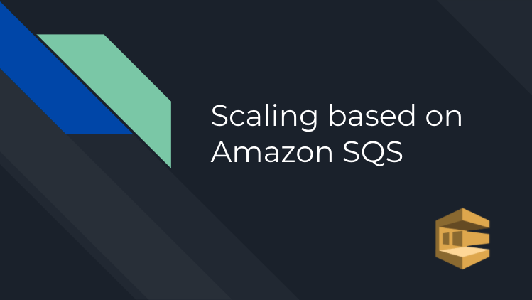

# scaling-based-on-aws-sqs
**Deep dive on how to scale instances based on AWS SQS**
## Video Tutorial - TODO ONCE THE VIDEO IS READY - do a screenshot with the youtube indication
[](https://www.youtube.com/watch?v=un62_Y5v1UA "Example")

## Architecture


## backlog-per-instance-calculator 
Serverless framework project for building applications on AWS Lambda
### calculateBacklogPerInstance Lambda
Lambda function that is triggered every minute, calculates backlog per instance and publish a custom metric
> backlog per instance = SQS.ApproximateNumberOfMessages / runningInstances
### logAutoScalingGroupEvents Lambda
Lambda function that is triggered by selected events of aws.autoscaling (debugging lambda)
- 'EC2 Instance Launch Successful'
- 'EC2 Instance Launch Unsuccessful'
- 'EC2 Instance Terminate Successful'
- 'EC2 Instance Terminate Unsuccessful'
## sqs-worker
A naive implementation of a dockerized nodejs sqs-worker\
Each message handling takes 1 min to complete\
Whenever a new EC2 instance is launched, it pulls and run this container [sqs-worker container](https://hub.docker.com/repository/docker/nirf/simple-sqs-worker)

Accepts the following environment variables:
```
AWS_PROFILE=<profile>
or
AWS_ACCESS_KEY_ID=<access-key>
AWS_SECRET_ACCESS_KEY=<secret-key>

AWS_REGION=<region>
QUEUE_URL=<sqs-queue-url>
LOCALSTACK_ENABLED=<boolean> - you should have localstack installed
```
## Terraform
Infrastructure as code
## Running instructions
Terraform and serverless framework must be installed!\
Running order is important!
### Terraform
#### Creating ssh keys
```
scaling-based-on-aws-sqs/infra> ssh-keygen -t rsa
Enter file in which to save the key: <full-path>/scaling-based-on-aws-sqs/infra/mykey
```
#### Running terraform
```
scaling-based-on-aws-sqs/infra> terraform init
scaling-based-on-aws-sqs/infra> terraform apply
```
### Serverless
```
scaling-based-on-aws-sqs/backlog-per-instance-calculator> npm i -g serverless
scaling-based-on-aws-sqs/backlog-per-instance-calculator> npm i
scaling-based-on-aws-sqs/backlog-per-instance-calculator> serverless deploy
```
### Publish messages to the SQS Q
Copy the created queue-url (from terraform output or from AWS console) and paste it in [publishMessages.js](backlog-per-instance-calculator/src/scripts/publishMessages.js)\
The script publishes batchSize messages to the queue, in each round, and sleeps sleepInMs between each iteration
```
scaling-based-on-aws-sqs/backlog-per-instance-calculator> npm run publish
```
### Useful commands for debugging
Lets you watch the logs of a specific function.
```
scaling-based-on-aws-sqs/backlog-per-instance-calculator> serverless logs -f logAutoScalingGroupEvents -t
```
```
scaling-based-on-aws-sqs/backlog-per-instance-calculator> serverless logs -f calculateBacklogPerInstance -t
```
### Cleanup
Cleanup order is important!
#### Serverless
```
scaling-based-on-aws-sqs/backlog-per-instance-calculator> serverless remove
```
#### Terraform
```
scaling-based-on-aws-sqs/infra> terraform destroy
```
## Links
This project is inspired by [Scaling based on Amazon SQS](https://docs.aws.amazon.com/autoscaling/ec2/userguide/as-using-sqs-queue.html)
\
Lambda functions are deployed using [Serverless Framework](https://www.serverless.com/framework/docs/getting-started)
\
Infrastructue as code [Terraform](https://www.terraform.io/)


